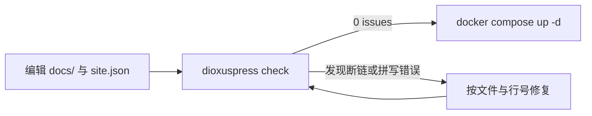

# CLI 命令与校验流转图

DioxusPress 原生支持在 Markdown 中直接编写 `mermaid` 代码块渲染矢量流程图：

```mermaid
flowchart LR
  Edit["编辑 docs/ 与 site.json"] --> Check["dioxuspress check"]
  Check -->|"0 issues"| Run["docker compose up -d"]
  Check -->|"发现断链或拼写错误"| Fix["按文件与行号修复"]
  Fix --> Check
```

返回 [快速开始](/docs/guide/getting-started) 或阅读发布公告 [v0.1 正式发布](/blog/v0-1-release)。
